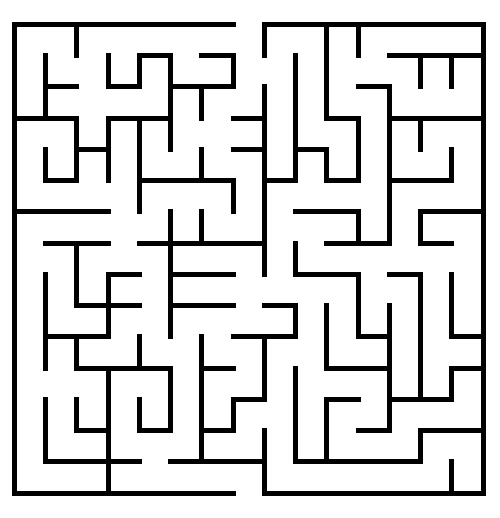
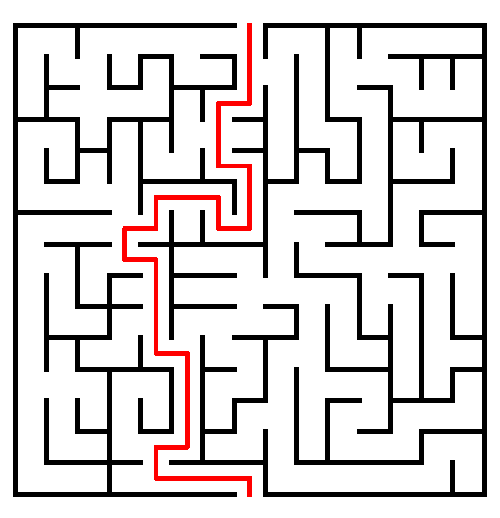

```{r, echo=FALSE}
#Clears memory
rm(list = ls())

#Clear the console
cat("\014")

set.seed(100)

setwd("C:/Users/Magdalena Bennett/Dropbox/PhD Columbia/Fall 2016/Core Methods in EDM/final project")
```

#The Maze
### (any relationship to West World is pure coincidence...)

In this project, I want to use positioning data to analyze how people (especifically kids) respond to different types of instructions when solving a maze.

(Disclaimer: Given that I don't have access to kids, I'll use the next best thing (?))

This is the maze the participant will have to solve:



First, the participant will be asked to run the maze with the cellphone in vertical position. He will not have time to analyze the maze beforhand, so he will have to solve it as he goes along. After 30 seconds, the task will be over. Our participant looks like this (solving the giant maze):


For the second task, we will show the participants the solution of the maze for 3 seconds, and then ask him to solve the maze again. The learning process will come from the fact that he already covered the maze once (probably unsuccessfully) and, additionally, a visual cue as this one:




In order to evaluate how the participant solve the maze, I have the data for the "solved maze":
```{r}
d_solve<-read.csv("test_maze-gyr.csv")
names(d_solve)
```

Because of the position of the phone, the dimension that we are interested in the gyroscope is the X plain (we'll rename it for simplicity):
```{r}
library("dplyr")

d_solve$time <- d_solve$time_tick
d_solve$x_turn <- d_solve$gyr_X_value

d_solve <- select(d_solve,time,x_turn)
```

Additionally, I'll trim the data to when the maze was actually started and finished:
```{r}
d_solve <- d_solve[d_solve$time>=4 & d_solve$time<=30,]
```

And now we plot!

```{r}
plot(d_solve$time,d_solve$x_turn, type="o",lty=1,cex=0.8)

```


Now we get the data from the first try (no cues):
```{r}
d_first<-read.csv("kyle_wrong1-gyr.csv")
names(d_first)
```

We rename it again, for simplicity, and trim the data:
```{r}
d_first$time <- d_first$time_tick
d_first$x_turn <- d_first$gyr_X_value

d_first <- select(d_first,time,x_turn)

d_first <- d_first[d_first$time>=4.3 & d_first$time<=30.3,]
```

And now we plot again!

```{r}
plot(d_first$time,d_first$x_turn, type="o",lty=1,cex=0.8)
```

Let's compare it now to the solved maze:
```{r}
plot(d_first$time,d_first$x_turn, type="o",lty=1,cex=0.8)
lines(d_solve$time,d_solve$x_turn, type = "o", col = "blue", cex=0.8)
```

We can see that, at the begininng, there's a similar pattern, but then there are different turns. In order to see this more clearly, I will adapt the time variable:

```{r}
time_aux <- seq(1,26,((26-1)/(780-1)))

plot(time_aux,d_first$x_turn, type="o",lty=1,cex=0.8)
lines(time_aux,d_solve$x_turn, type = "o", col = "blue", cex=0.8)
```

In this first try, the participant did not get the maze right (in the given amount of time)

After this, we showed the solution of the maze for 3 seconds to the participant. In this case, he did get the maze:

```{r}
d_second<-read.csv("kyle_right2-gyr.csv")
names(d_second)
```

```{r}
d_second$time <- d_second$time_tick
d_second$x_turn <- d_second$gyr_X_value

d_second <- select(d_second,time,x_turn)
```

```{r}
d_second <- d_second[d_second$time>=4.6 & d_second$time<=32.4,]
```

Plot for the new try:

```{r}
plot(d_second$time,d_second$x_turn, type="o",lty=1,cex=0.8)
```

Let's compare it now to the solved maze:
```{r}
plot(d_second$time,d_second$x_turn, type="o",lty=1,cex=0.8)
lines(d_solve$time,d_solve$x_turn, type = "o", col = "blue", cex=0.8)
```

We can see similar patterns, but because the second time the person was slower, we will change the time axis to try and match the pattern:

```{r}
time_aux1 <- seq(1,26,((26-1)/(nrow(d_solve)-1)))
time_aux2 <- seq(1,26,((26-1))/(nrow(d_second)-1))

plot(time_aux2,d_second$x_turn, type="o",lty=1,cex=0.8)
lines(time_aux1,d_solve$x_turn, type = "o", col = "blue", cex=0.8)
```

It is more clear in this case that the maze was completed successfully in the optimal way. To make it more clear, we will divide it in sections:

- *Sections*:
```{r}
plot(time_aux2,d_second$x_turn, type="o",lty=1,cex=0.8)
lines(time_aux1,d_solve$x_turn, type = "o", col = "blue", cex=0.8)
abline(v=4.3, col="blue",lty=2)
abline(v=3.6,lty=2)
abline(v=15, col="blue",lty=2)
abline(v=16,lty=2)
text(x=2, y=-4.5,"S 1",col="dark grey")
text(x=10,y=-4.5,"S 2",col="dark grey")
text(x=22,y=-4.5,"S 3",col="dark grey")
```

We can see that section 1 and section 3 are somewhat displaced with respect to the solved version, so we'll displace them to see if the patterns actually match

- Section 1:
```{r}
plot(time_aux2,d_second$x_turn, type="o",lty=1,cex=0.8)
lines(time_aux1,d_solve$x_turn, type = "o", col = "blue", cex=0.8)
abline(v=4.3, col="blue",lty=2)
abline(v=3.6,lty=2)

time_sec11 <- time_aux1[time_aux1<4.3]-(4.3-3.6)
```

- Section 3:
```{r}
plot(time_aux2,d_second$x_turn, type="o",lty=1,cex=0.8)
lines(time_aux1,d_solve$x_turn, type = "o", col = "blue", cex=0.8)
abline(v=15, col="blue",lty=2)
abline(v=16,lty=2)

time_sec31 <- time_aux1[time_aux1>15]+1
```

Finally, now that we have broken the sections, we can see clearly that the patterns from the second try (after giving the visual cue) match the solved version of the maze.
```{r}
plot(time_aux2,d_second$x_turn, type="o",lty=1,cex=0.8)
lines(time_sec11,d_solve[time_aux1<4.3,]$x_turn, type = "o", col = "blue", cex=0.8)
lines(time_aux1[time_aux1>=4.3 & time_aux1<=15],d_solve[time_aux1>=4.3 & time_aux1<=15,]$x_turn, 
      type = "o", col = "blue", cex=0.8)
lines(time_sec31,d_solve[time_aux1>15,]$x_turn, type = "o", col = "blue", cex=0.8)
```

Thus, in this way we are able to assess if the person solved the maze in the optimal way (which is the objective of the task).

We can also simplify the solution of the maze by just analyzing the turns that the individual has to do to optimally solve it.

If we observe the solution of the maze, it is easy to see that the sequence of turns is the following (imagine the person walking through the maze, starting at the top):


- Right - Left - Left - Right - Right- Right - Left - Left - Right - Left - Left - Right - Left - Right - Right - Left - Left - Right.

In terms of the gyroscope, right turns are identified with negative degrees (radians), and left turns are identified with positive ones. To make the data analysis more simple, we will simplify our data using a spline function with many degrees of freedom. In this way, we will stil be able to identify the turns, but lose some of the noise in the data: 

```{r}
plot(d_solve$time,d_solve$x_turn, type="o",lty=1,cex=0.8)
ss_solve <- smooth.spline(d_solve$time,d_solve$x_turn, df=55)
plot(ss_solve,ylim=c(-3,3))

#plot(ss_solve,ylim=c(-3,3))
#lines(d_solve$time,d_solve$x_turn, type = "o", col = "blue", cex=0.8)
```

In this case, we can identify the places were there are local maxs and mins. Red are left turns (positive local max) and blue are right turns (negative local min). Green in this case are local max or min that do not indicate turns:
```{r}
local_max <- which(diff(sign(diff(ss_solve$y)))==-2)+1
local_min <- which(diff(sign(diff(ss_solve$y)))==2)+1


plot(ss_solve,ylim=c(-3,3))
for(i in 1:length(local_max)){
  points(ss_solve$x[local_max[i]],ss_solve$y[local_max[i]], col="red", cex=1.5, type="o")
}

for(i in 1:length(local_min)){
  points(ss_solve$x[local_min[i]],ss_solve$y[local_min[i]], col="green", cex=1.5, type="o")
}

for(i in 1:length(local_min)){
  if(ss_solve$y[local_min[i]] < -0.2){
    points(ss_solve$x[local_min[i]],ss_solve$y[local_min[i]], col="blue", cex=1.5, type="o")
  }
}

for(i in 1:length(local_min)){
  if(ss_solve$y[local_max[i]] < 0.2){
    points(ss_solve$x[local_max[i]],ss_solve$y[local_max[i]], col="green", cex=1.5, type="o")
  }
}
```


Let's do the same thing with the data for when the participant solved the maze:

```{r}
plot(d_second$time,d_second$x_turn, type="o",lty=1,cex=0.8)
ss_second <- smooth.spline(d_second$time,d_second$x_turn, df=40)
plot(ss_second,ylim=c(-3,3))

#plot(ss_second,ylim=c(-3,3))
#lines(d_second$time,d_second$x_turn, type = "o", col = "blue", cex=0.8)
```

```{r}
local_max_sec <- which(diff(sign(diff(ss_second$y)))==-2)+1
local_min_sec <- which(diff(sign(diff(ss_second$y)))==2)+1

plot(ss_second,ylim=c(-3,3))
for(i in 1:length(local_max_sec)){
  points(ss_second$x[local_max_sec[i]],ss_second$y[local_max_sec[i]], col="red", cex=1.5, type="o")
}

for(i in 1:length(local_min_sec)){
  points(ss_second$x[local_min_sec[i]],ss_second$y[local_min_sec[i]], col="green", cex=1.5, type="o")
}

for(i in 1:length(local_min_sec)){
  if(ss_second$y[local_min_sec[i]] < -0.2){
    points(ss_second$x[local_min_sec[i]],ss_second$y[local_min_sec[i]], col="blue", cex=1.5, type="o")
  }
}

for(i in 1:length(local_max_sec)){
  if(ss_second$y[local_max_sec[i]] < 0.2){
    points(ss_second$x[local_max_sec[i]],ss_second$y[local_max_sec[i]], col="green", cex=1.5, type="o")
  }
}
```

Finally, we create a vector of right and left turns. First, according to the observed solution from the map, then from the solved data, and finally, from the second try of the participant:
```{r}
#Theoretic solution:
#- Right - Left - Left - Right - Right- Right - Left - Left - Right - Left - Left - Right - Left - Right - Right - Left - Left - Right.
solve_theo <- c(-1,1,1,-1,-1,-1,1,1,-1,1,1,-1,1,-1,-1,1,1,-1)

#Test solution:
right_turn <- local_min[(ss_solve$y[local_min]< -0.2)==TRUE]
left_turn <- local_max[(ss_solve$y[local_max]> 0.2)==TRUE]

solve_test<- rbind(cbind(right_turn,-1),cbind(left_turn,1))
solve_test <- as.data.frame(solve_test)
names(solve_test) <- c("pos","turn")

solve_test <- solve_test[order(solve_test$pos),]

solve_test <- solve_test$turn

##Solve second

right_turn <- local_min_sec[(ss_second$y[local_min_sec]< -0.2)==TRUE]
left_turn <- local_max_sec[(ss_second$y[local_max_sec]> 0.2)==TRUE]

solve_sec<- rbind(cbind(right_turn,-1),cbind(left_turn,1))
solve_sec <- as.data.frame(solve_sec)
names(solve_sec) <- c("pos","turn")

solve_sec <- solve_sec[order(solve_sec$pos),]

solve_sec <- solve_sec$turn

### Solutions

solve_theo
solve_test
solve_sec

```

Finally, we can see that simplifying the data, we can see that all solutions match regarding the turns. This allows us to compare more easily the paths, without having to analyze full patterns.